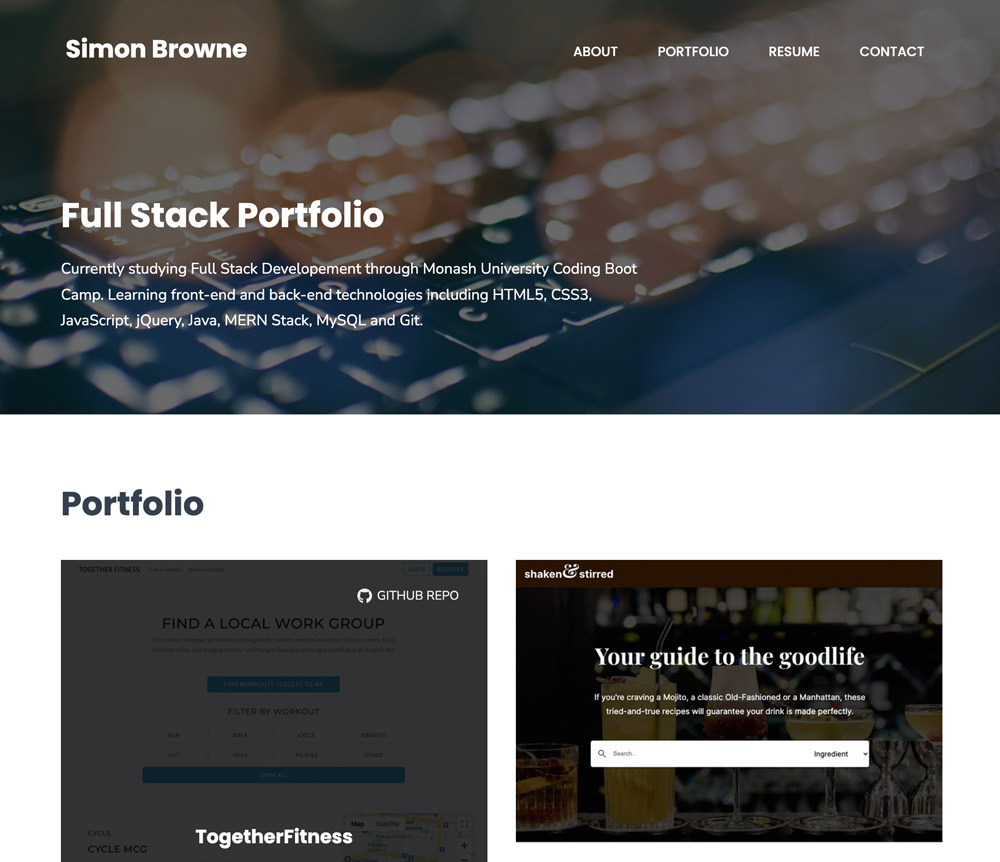
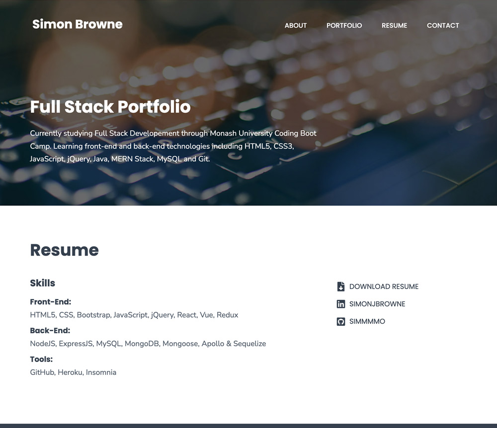
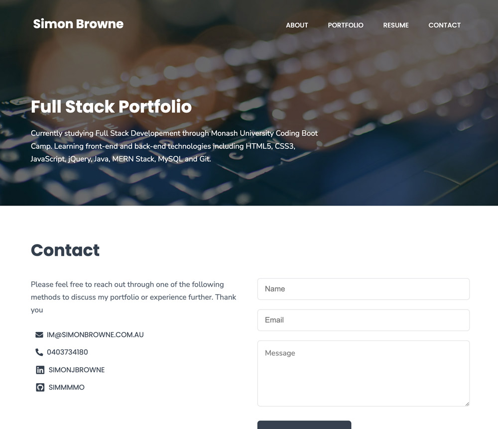
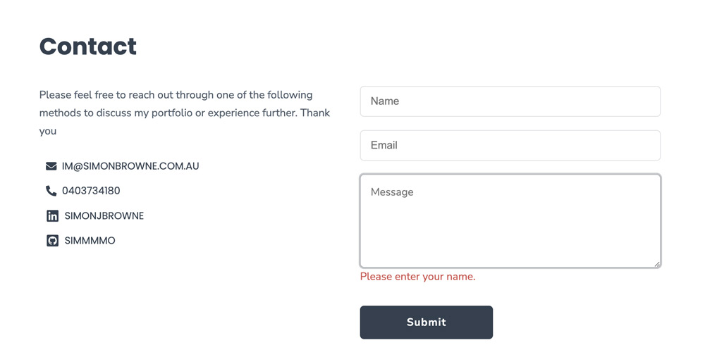

# SJB React Portfolio (sjb-react-portfolio)

## Description

Update my portfolio using React to display examples of my projects and skills. My portfolio include contact details and my resume.

## User Story

```md
AS AN employer looking for candidates with experience building single-page applications
I WANT to view a potential employee's deployed React portfolio of work samples
SO THAT I can assess whether they're a good candidate for an open position
```

## Preview

##### About


##### Portfolio



##### Resume



##### Contact



##### Contact Validation



## Installation

##### Local Installation

- Clone the repository from [Github](git@github.com:simmmmo/sjb-react-portfolio.git)
- Ensure Node.js is installed
- Install dependencies
  [express package](https://www.npmjs.com/package/express)

```bash
npm install
```

- Ensure all additional packages have been installed

## Usage

##### GitHub Pages Environment

- https://simmmmo.github.io/sjb-react-portfolio

## Technology

- Node.js
- ReactJS
- React-icons
- CSS
- HTML

## Project Links

##### Repo name

- sjb-react-portfolio

##### GitHub enviroment

- https://github.com/simmmmo/sjb-react-portfolio
- git@github.com:simmmmo/sjb-react-portfolio.git

##### GitHub Pages Environment

- https://simmmmo.github.io/sjb-react-portfolio
